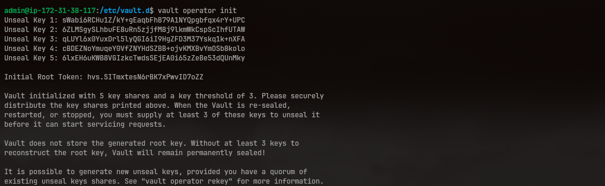
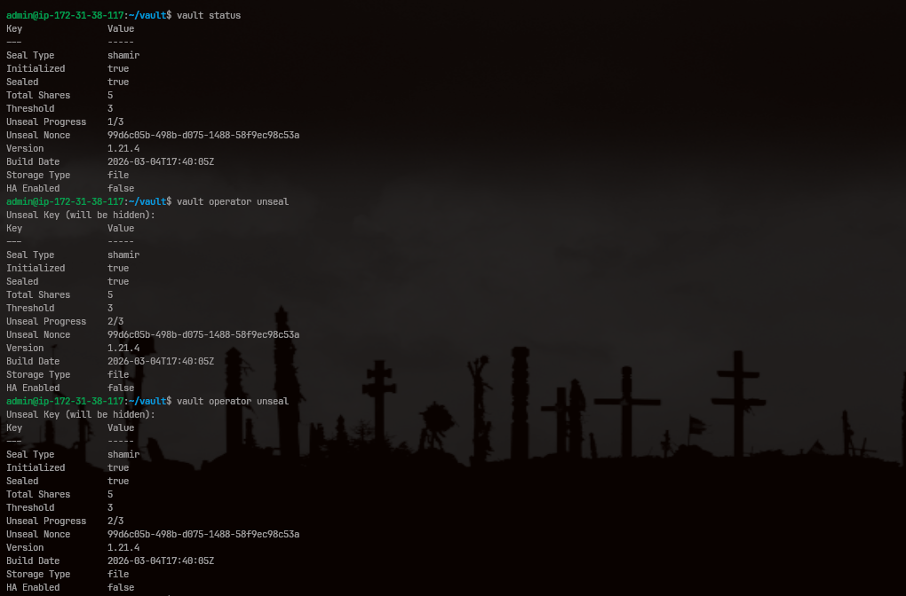
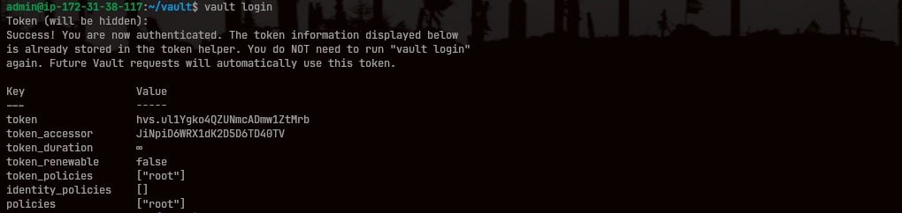
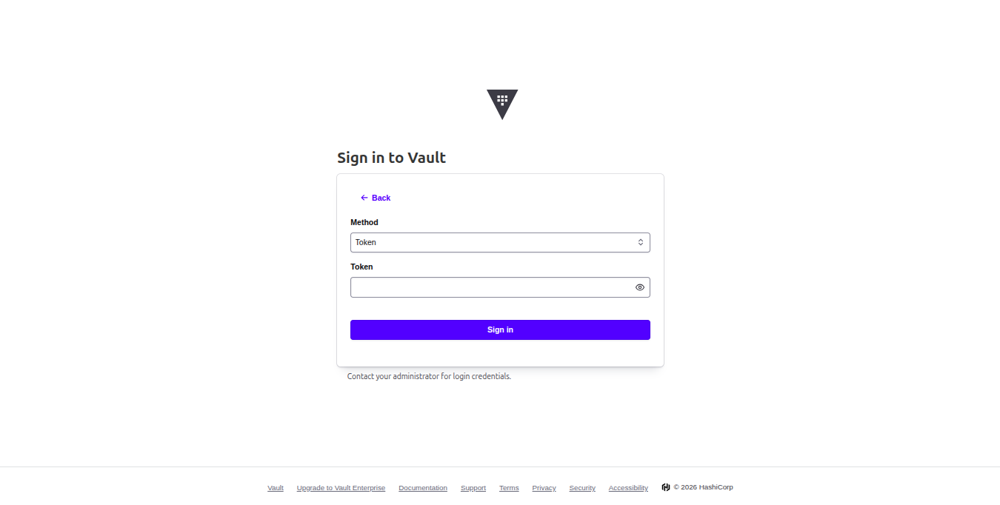

# Spinning up Hashicorp Vault

## Volume persistance

Replicate given setup for volume persistance.

```
.
├── config
│   └── vault.hcl
├── data
├── docker-compose.yaml
└── logs
```

### Set appropriate ownership

To ensure Vault's default docker user can write to the local folder, set the necessary permission

```bash
chown -R 100:1000 .data/ ./log ./config
```

### Configuration file

Create `config/vault.hcl` config file.

Use offical template file to start with:

```bash
curl https://raw.githubusercontent.com/hashicorp/vault/refs/heads/main/.release/linux/package/etc/vault.d/vault.hcl
```

```hcl
ui = true
disable_mlock = true

listener "tcp" {
    address = "0.0.0.0:8200"
    tls_disable = true
}

storage "raft" {
    node_id = "first_node"
    path = "/vault/data"
}

api_addr = "http://127.0.0.1:8200"
cluster_addr = "https://127.0.0.1:8201"

log_level = "info"
```

### Writing configuration file

| Config | Meaning |
| - | - |
| `disable_mlock = true` | first try to enable it, if that fails then only disbale memory lock |
| `tls_disable = true` | disable TLS encryption |
| `api_addr` | allow standby nodes to redirect query to leader node |
| `cluster_addr` | instead of redirection, standby node can proxy request for client |

## Docker Compose

Now create a docker compose file.

```docker-compose
services:
  vault:
    image: hashicorp/vault:1.21.4
    restart: unless-stopped
    cap_add:
      - IPC_LOCK
    ports:
      - "8200:8200"
      - "8201:8201"
    volumes:
      - ./config:/vault/config
      - ./data:/vault/data
      - ./logs:/vault/logs
    environment:
      VAULT_ADDR: http://127.0.0.1:8200
    command: server -config=/vault/config/vault.hcl
```

> `cap_add: - IPC_LOCK` allow container to use `mlock` system call to prevent memory swap.

### Initialize the vault

```bash
vault operator init
```

*Additional flags*

```bash
-key-shares=5
-key-threshold=3
```



> Make sure to save the output somewhere safe, that's gonna be needed if vault ever restarts.

### Unseal the vault

Use the unique previously genrated key for `key-threshold` (default to `3`) times to unseal the vault.  
In this process, master key is reconstructed used to decrypt sotrage backend.

```bash
vault operator unseal
```


### Vault Status

You can check your current vault status using,

```bash
vault status
```

### Vault Login

```bash
vault login
```



You can now navigate to the browser and use the provided root token to login.

